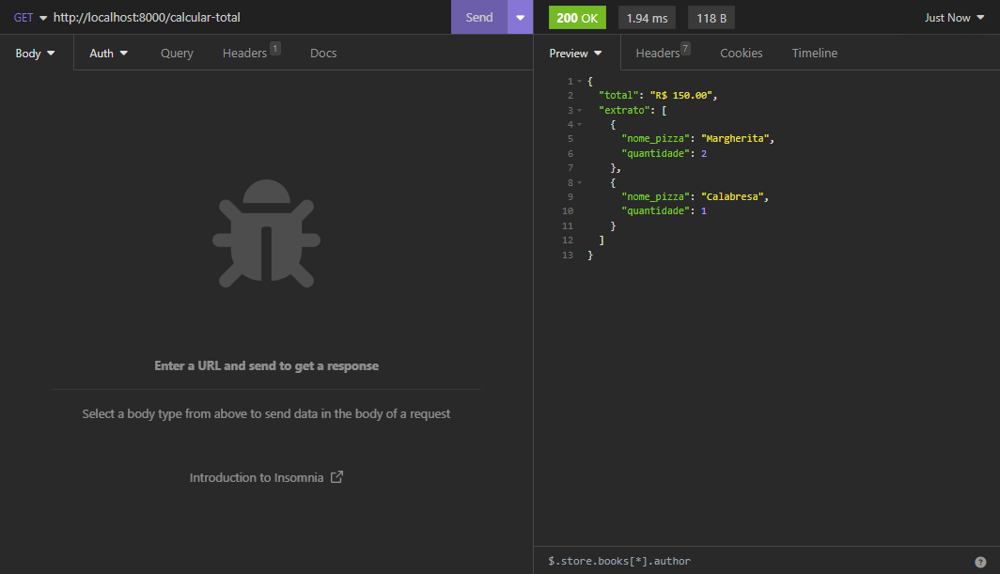

# Cardapio de Pizzaria

## Sobre

Este é um projeto de um cardápio de pizzaria desenvolvido em Javascript e Node.js utilizando o framework Express. O projeto oferece funcionalidades para consultar informações detalhadas sobre diversas opções de pizzas, adicionar pizzas ao carrinho de compras, calcular o valor total do carrinho e remover pizzas do carrinho.

## Funcionalidades

- **Consultar Pizza:** Você pode obter informações detalhadas sobre uma pizza específica, como nome, valor e ingredientes.

- **Adicionar ao Carrinho:** Adicione pizzas ao carrinho de compras, podendo escolher a quantidade desejada.

- **Remover do Carrinho:** Remova pizzas do carrinho de compras, caso mude de ideia.

- **Calcular Valor Total:** Calcule o valor total das pizzas presentes no carrinho, obtendo um resumo do pedido.

## Como Executar o Projeto

### Pré-requisitos

Certifique-se de ter o npm instalado em sua máquina.
Certifique-se de ter o Node.js instalado em sua máquina.
Utilize alguma ferramenta que le auxilie na realização das ações do tipo POST, DELETE, como o Insomnia.

### Passos

- **Clone o repositório**.
- Abra o terminal na pasta do projeto.
- Execute o comando: `npm install`
- Inicie a aplicação: `node src/index.js`

### Rotas

Com o servidor em execução, utilize uma ferramenta como o Insomnia para realizar as ações de consulta, adição e remoção de pizzas no carrinho.

- **GET** - http://localhost:8000/consultar/:nome
Consulta informações detalhadas sobre uma pizza específica.

- **POST** - http://localhost:8000/adicionar-ao-carrinho/:nome?quantidade=1
Adiciona pizzas ao carrinho de compras, podendo especificar a quantidade desejada.

- **DELETE** - http://localhost:8000/remover-do-carrinho/:nome
Remove pizzas do carrinho de compras.

- **GET** - http://localhost:8000/calcular-total
Calcula o valor total das pizzas presentes no carrinho, obtendo um resumo do pedido.

### Demonstração do Sistema

#### Consultando Pizza

Consultando informações detalhadas sobre uma pizza específica.

#### Adicionando ao Carrinho

Adicionando pizzas ao carrinho de compras, podendo especificar a quantidade desejada.

#### Adicionando ao Carrinho 2

Adicionando mais pizzas ao carrinho de compras.

#### Extrato

Resumo do pedido mostrando as pizzas no carrinho e a quantidade.

